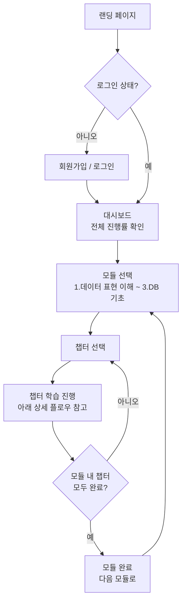
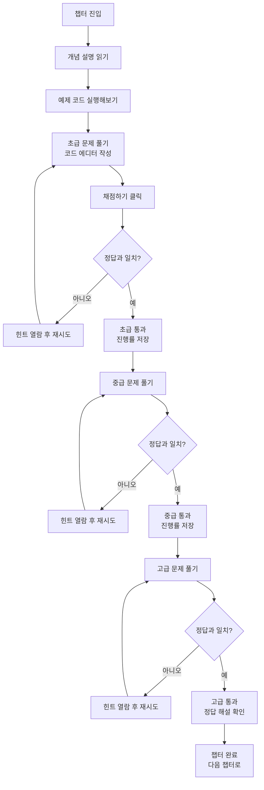

# Data Learning Lab

비전공자를 위한 Python 데이터분석 · 시각화 · 데이터베이스 학습 웹앱

## 목표
Python(Pandas) 데이터 분석, 시각화, DB 활용을 비전공자도 쉽게 배울 수 있도록, 데이콘보다 진입장벽을 낮춘 실습 + 자동채점 + 정답해설 형태의 학습 서비스를 만듭니다. 회원가입, 학습 진행률 저장, 브라우저 내에서 직접 코드 작성·실행, 단원별 초급/중급/고급 복습까지 지원하는 실제 동작하는 웹앱으로 개발합니다.

## 기획 자료
전체 커리큘럼 플로우, 자동채점 구조, 화면 와이어프레임 등은 별도 기획 캔버스에 정리되어 있습니다.
→ [Data Learning Lab Plan](https://claude.ai/code/artifact/ea4268c9-b905-4c0b-8bad-90071a4c4537)

## 앱 플로우

### 전체 플로우


### 상세 플로우 — 챕터 하나의 학습 흐름


## 기술 스택
| 영역 | 사용 기술 |
|---|---|
| 프론트엔드 | React + TypeScript (Vite) |
| 회원가입/로그인 · DB | Supabase (Auth + Postgres) |
| 코드 에디터 | Monaco Editor (연결 검증 완료) |
| 코드 실행 · 채점 | Pyodide — 브라우저에서 Python 실행, pandas/numpy/matplotlib 지원, 챕터별로 필요한 패키지만 로드 (연결 검증 완료) |
| 화면 이동(라우팅) | React Router (`react-router-dom`) — 챕터별 URL(`/chapter/:chapterId`) 이동 |
| 배포 | Vercel / GitHub Pages *(예정)* |

## 커리큘럼
총 3개 모듈, 15개 챕터로 구성됩니다. 각 챕터는 초급 → 중급 → 고급 3단계로 복습하며,
각 단계마다 여러 개의 실습 문제를 풀어야 다음 단계가 열립니다.

**1. 데이터 표현 이해** (선형대수 · 함수 · 통계 감각)
1. 벡터와 행렬로 데이터 표현하기 *(완성)*
2. 가중합과 계산 이해하기 *(완성)*
3. 함수와 그래프 이해하기 *(완성)*
4. 데이터 요약과 통계

**2. 데이터 시각화** (Pandas + Matplotlib/Seaborn + 프로젝트)
1. DataFrame이란? *(완성)*
2. 데이터 불러오기와 정제 *(완성)*
3. 데이터 탐색과 분석 *(완성)*
4. 데이터 시각화 *(완성)*
5. 프로젝트 기반 학습 (헬스케어 미니 프로젝트) *(완성)*

**3. 데이터베이스(DB) 기초** (SQL + Python 연동 + ORM + NoSQL)
1. 데이터베이스 기본 개념 이해
2. SQL 기초 및 데이터 조회
3. Python + DB 연동 경험
4. ORM(SQLAlchemy)과 모델링
5. NoSQL(MongoDB) 이해와 활용
6. 프로젝트 기반 실습

## 현재 진행 상황
- [x] React + TypeScript 프로젝트 뼈대 생성 (Vite)
- [x] Supabase 프로젝트 생성 및 연결 (회원가입/로그인 동작 확인 완료)
- [x] `progress` 테이블 + RLS 보안 정책 생성 ([supabase/schema.sql](supabase/schema.sql))
- [x] 브라우저 코드 에디터 + 실행 환경 (Monaco + Pyodide) 검증
- [x] 챕터 1 완성 — "2. 데이터 시각화 > DataFrame이란?" (개념설명 → 예제 → 초급/중급/고급 각 3문제씩 자동채점)
- [x] 학습 진행률 저장 기능 — 통과 시 Supabase에 저장, 새로고침해도 유지됨
- [x] 회원가입/로그인 화면 디자인 — 데스크톱 2단 분할 / 모바일 반응형
- [x] 전체 커리큘럼 3모듈 15챕터 구조 확정, 사이드바에 전체 로드맵 노출
- [x] 챕터 간 라우팅 — 사이드바 클릭 시 실제 페이지 전환(`/chapter/:chapterId`), 새로고침해도 유지, 미완성 챕터는 "준비중" 화면 표시
- [x] 챕터 렌더링 구조 리팩토링 — 챕터 전용 컴포넌트 대신 공용 `ChapterPage` + 챕터별 데이터 파일(`src/chapters/*.ts`) 구조로 정리, 새 챕터 추가가 쉬워짐
- [x] 챕터 2 완성 — "2. 데이터 시각화 > 데이터 불러오기와 정제" (shape/결측치/자료형 → 통계 요약/숫자형 선택/결측행 제거 → 중앙값 대체/컬럼 제거/describe 요약)
- [x] 챕터 3 완성 — "2. 데이터 시각화 > 데이터 탐색과 분석" (고유값/값 개수/다중조건 필터 → 그룹별 다중집계/그룹별 min·max/상위 N개 → 상관계수/교차표/IQR 이상치)
- [x] 챕터 4 완성 — "2. 데이터 시각화 > 데이터 시각화" (matplotlib 도입: 막대/선/히스토그램 → 제목·축이름/서브플롯/박스플롯 → 산점도+추세선/상관관계 히트맵/그룹별 박스플롯 비교). 브라우저에서 그래프를 이미지로 렌더링(예제 코드), 채점은 그래프 객체의 데이터를 코드로 검사하는 방식
- [x] 챕터 5 완성 — "2. 데이터 시각화 > 프로젝트 기반 학습" (가상 건강검진 데이터로 미니 프로젝트: 정제 → pd.cut 구간화/그룹별 발생률/상관관계 → 시각화/종합 결론). **모듈2(데이터 시각화) 5챕터 전부 완성**
- [x] 챕터 6 완성 — "1. 데이터 표현 이해 > 벡터와 행렬로 데이터 표현하기" (NumPy 도입: shape/벡터덧셈 → 전치/내적/행렬곱 → 스칼라곱/항등행렬/벡터정규화)
- [x] 챕터 7 완성 — "1. 데이터 표현 이해 > 가중합과 계산 이해하기" (가중합/편향/가중치정규화 → 가중평균/배치가중합/다중출력 → ReLU/퍼셉트론/가중치 비교)
- [x] 챕터 8 완성 — "1. 데이터 표현 이해 > 함수와 그래프 이해하기" (선형/지수/로그 계산 → 그래프 비교/Sigmoid 계산·그리기 → 함수 성장속도 비교/ReLU·Sigmoid 비교/수치미분)
- [x] 버그 수정 — 챕터 이동 시 이전 챕터의 실행결과·채점상태가 안 지워지던 문제 (`ChapterPage`에 `key` 부여)
- [ ] 대시보드 화면 (전체 진행률 %) 제작
- [ ] 나머지 7개 챕터 콘텐츠 제작 (모듈1 나머지 1개, 모듈3 전체)

## 로컬 실행 방법
```bash
npm install
npm run dev
```

Supabase 연결을 위해 프로젝트 루트에 `.env` 파일이 필요합니다 (`.env`는 git에 포함되지 않습니다):
```
VITE_SUPABASE_URL=...
VITE_SUPABASE_PUBLISHABLE_KEY=...
```
