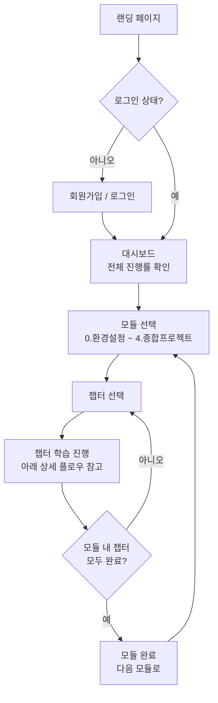
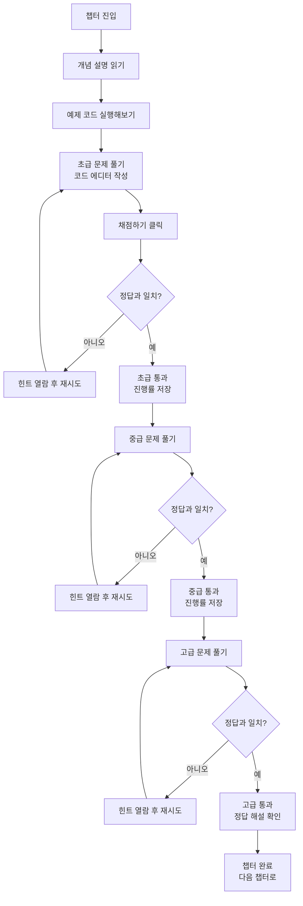

# Data Learning Lab

비전공자를 위한 Python 데이터분석 · 시각화 · 데이터베이스 학습 웹앱

## 목표
Python(Pandas) 데이터 분석, 시각화, DB 활용을 비전공자도 쉽게 배울 수 있도록, 데이콘보다 진입장벽을 낮춘 실습 + 자동채점 + 정답해설 형태의 학습 서비스를 만듭니다. 회원가입, 학습 진행률 저장, 브라우저 내에서 직접 코드 작성·실행, 단원별 초급/중급/고급 복습까지 지원하는 실제 동작하는 웹앱으로 개발합니다.

## 기획 자료
전체 커리큘럼 플로우, 자동채점 구조, 화면 와이어프레임 등은 별도 기획 캔버스에 정리되어 있습니다.
→ [Data Learning Lab Plan](https://claude.ai/code/artifact/ea4268c9-b905-4c0b-8bad-90071a4c4537)

## 앱 플로우

### 전체 플로우


### 상세 플로우 — 챕터 하나의 학습 흐름


## 기술 스택
| 영역 | 사용 기술 |
|---|---|
| 프론트엔드 | React + TypeScript (Vite) |
| 회원가입/로그인 · DB | Supabase (Auth + Postgres) |
| 코드 에디터 | Monaco Editor (연결 검증 완료) |
| 코드 실행 · 채점 | Pyodide — 브라우저에서 Python 실행 (연결 검증 완료) |
| 배포 | Vercel / GitHub Pages *(예정)* |

## 커리큘럼
- 0. 환경설정
- 1. Pandas 데이터 분석
- 2. 데이터 시각화
- 3. DB / SQL 활용
- 4. 종합 프로젝트

각 단원은 초급 → 중급 → 고급 3단계로 복습할 수 있도록 구성합니다.

## 현재 진행 상황
- [x] React + TypeScript 프로젝트 뼈대 생성 (Vite)
- [x] Supabase 프로젝트 생성 및 연결 (회원가입/로그인 동작 확인 완료)
- [x] `progress` 테이블 + RLS 보안 정책 생성 ([supabase/schema.sql](supabase/schema.sql))
- [x] 브라우저 코드 에디터 + 실행 환경 (Monaco + Pyodide) 검증
- [ ] 챕터 1개 완성 — 개념설명 → 실습 → 자동채점 (초급/중급/고급)
- [ ] 학습 진행률 저장 기능 (실제 화면에 연결)
- [ ] 나머지 챕터 콘텐츠 제작

## 로컬 실행 방법
```bash
npm install
npm run dev
```

Supabase 연결을 위해 프로젝트 루트에 `.env` 파일이 필요합니다 (`.env`는 git에 포함되지 않습니다):
```
VITE_SUPABASE_URL=...
VITE_SUPABASE_PUBLISHABLE_KEY=...
```
